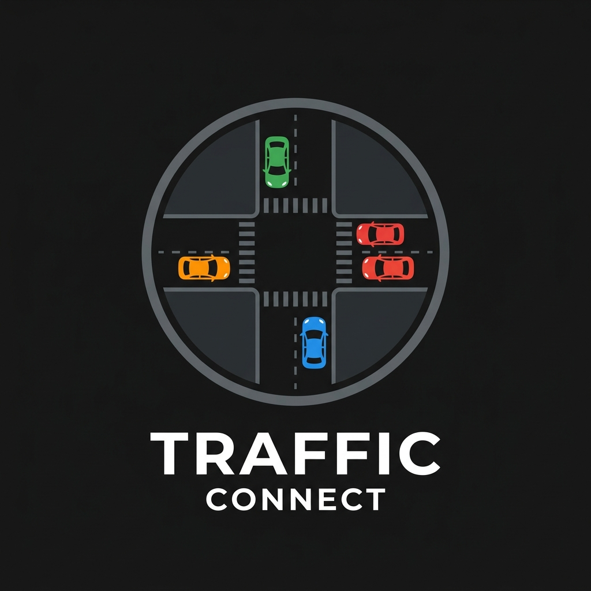

# 🚦 16-Way Traffic Intersection Simulator

<p align="center">
    
</p>

<p align="center">
  <strong>DON'T BLOCK THE BOX!</strong>
</p>

<p align="center">
  
  
  
  
</p>

**16-Way Traffic Intersection Simulator** is a high-fidelity 2D multi-agent traffic simulation application built in WPF utilizing .NET 10. It models a **4x4 grid** of 16 fully synchronized, independently cycling traffic light intersection nodes with self-driving vehicle agents.

The simulation features state-of-the-art 2D local-coordinate-projection collision avoidance, intersection-clearing priority (vehicles already inside an intersection have right-of-way to clear it), lane-keeping correction, gridlock prevention ("Don't Block the Box"), and consensus-based deadlock resolution — guaranteeing that vehicles drive smoothly without deadlocks, running red lights, going off-road, or colliding.

---

[Highlights](#highlights) · [Quick Start](#quick-start) · [Project Structure](#project-structure) · [How It Works](#how-it-works) · [UI & Controls](#ui--controls) · [License](#license)

---

## Highlights

- **Dynamic 16-Intersection Network:** Generates a **4x4 grid** of intersections (4 rows × 4 columns, 400px spacing). The canvas is `1700×1700` pixels and scaled to fit the window via `Viewbox`.
- **Advanced Coordinate Projection Collision Avoidance:** Translates the distance and angle vectors of surrounding obstacles directly into each vehicle's local frame. Vehicles detect cars ahead in their specific lane with extreme precision, adjusting speeds dynamically.
- **Intersection Clearing Priority:** Once a vehicle has crossed the stop line and entered an intersection, collision avoidance will not force it to stop — it maintains right-of-way to clear the box, preventing gridlock.
- **Lane-Keeping Correction:** After every straight-line position update, vehicles gently nudge back toward the lane centerline if they drift more than 2px, keeping them perfectly on the road.
- **Two-Phase Node Detection:** `GetActiveNode` first checks if the vehicle is near any node center (within 70px) for intersection logic; otherwise it finds the next node ahead. This prevents red-light running and ensures proper turn execution at every intersection.
- **Gridlock Prevention ("Don't Block the Box"):** Before crossing an intersection, vehicles count how many cars are on the target lane segment ahead. If a segment holds **6 or more cars**, the vehicle stays behind the stop line — regardless of light color — keeping the box clear.
- **Asymmetric Deadlock Resolution**: If two vehicles meet closely inside an intersection, a priority system based on vehicle heading geometry and a fallback ID-based tiebreaker ensures one vehicle yields while the other clears, preventing mutual lockups.
- **Varying Speed Profiles:** Each vehicle spawns with a randomized `MaxSpeed` (ranging from 2.0 to 5.0 pixels/frame). Faster cars smoothly decelerate to match the speed of slower cars they catch up to.
- **Visual Feedback Cues:** Features functional turn indicators (blinkers) that flash when a vehicle plans to turn, and visible windshield indicators showing the vehicle's direction of travel.

---

## Quick Start

### Prerequisites
- **Operating System:** Windows 10/11 (required for WPF desktop UI)
- **SDK:** .NET 10.0 SDK or later

### Build & Run from Source

1. **Clone the repository:**
   ```bash
   git clone https://github.com/PulseAISolutions/16-way-traffic-intersection.git
   cd 16-way-traffic-intersection
   ```

2. **Restore dependencies:**
   ```bash
   dotnet restore
   ```

3. **Build the project:**
   ```bash
   dotnet build
   ```

4. **Run the simulator:**
   ```bash
   dotnet run
   ```

---

## How It Works

### 1. Local Coordinate Projection
Standard angle cones or bounding-circle checks generate false positives (e.g., cars stopping for vehicles waiting at perpendicular red lights). To solve this, the physics engine rotates the relative vector `(dx, dy)` of nearby vehicles by `-vehicle.Angle` to translate it into the vehicle's local space `(localX, localY)`:

$$\begin{aligned}
\text{localX} &= dx \cdot \cos(\theta) + dy \cdot \sin(\theta) \\
\text{localY} &= -dx \cdot \sin(\theta) + dy \cdot \cos(\theta)
\end{aligned}$$

- **Ahead/Behind Check:** If `localX > 0`, the obstacle is in front of the vehicle.
- **Lateral Offset Check:** If `Math.Abs(localY) < 20` pixels, the obstacle is in our direct lane path.
This math allows cars to follow queues and safely clear intersections while ignoring perpendicular cars waiting at red lights.

### 2. Stop-Line Gatekeeping
When a vehicle reaches a stop line, it identifies its target lane segment based on its current position and `IntendedTurn`. It checks the count of active vehicles on that segment. If the count is $\ge 6$, it overrides the traffic light state and sets `canMove = false`, keeping the intersection clear for cross-street traffic.

### 3. Turning Snapping
Turning curves are calculated using angular velocities scaled by vehicle speed:
- Right turns rotate at $2.29 \cdot \text{Speed}$ degrees/frame.
- Left turns rotate at $0.764 \cdot \text{Speed}$ degrees/frame.
Upon completing the turn, the vehicle snaps to the exact target lane coordinate ($\pm 25$ pixels from the intersection center) and updates its `Direction` and `Angle`.

---

## UI & Controls

- **Start Simulation:** Begins the simulation loop, spawning vehicles dynamically.
- **Stop Simulation:** Pauses the simulation and clears current vehicles.
- **Restart:** Clears the simulation and restarts spawning immediately.
- **Vehicle Count:** Displays a real-time counter of active vehicles on the map.

---

## License

Distributed under the MIT License. See [LICENSE](LICENSE) for details.
